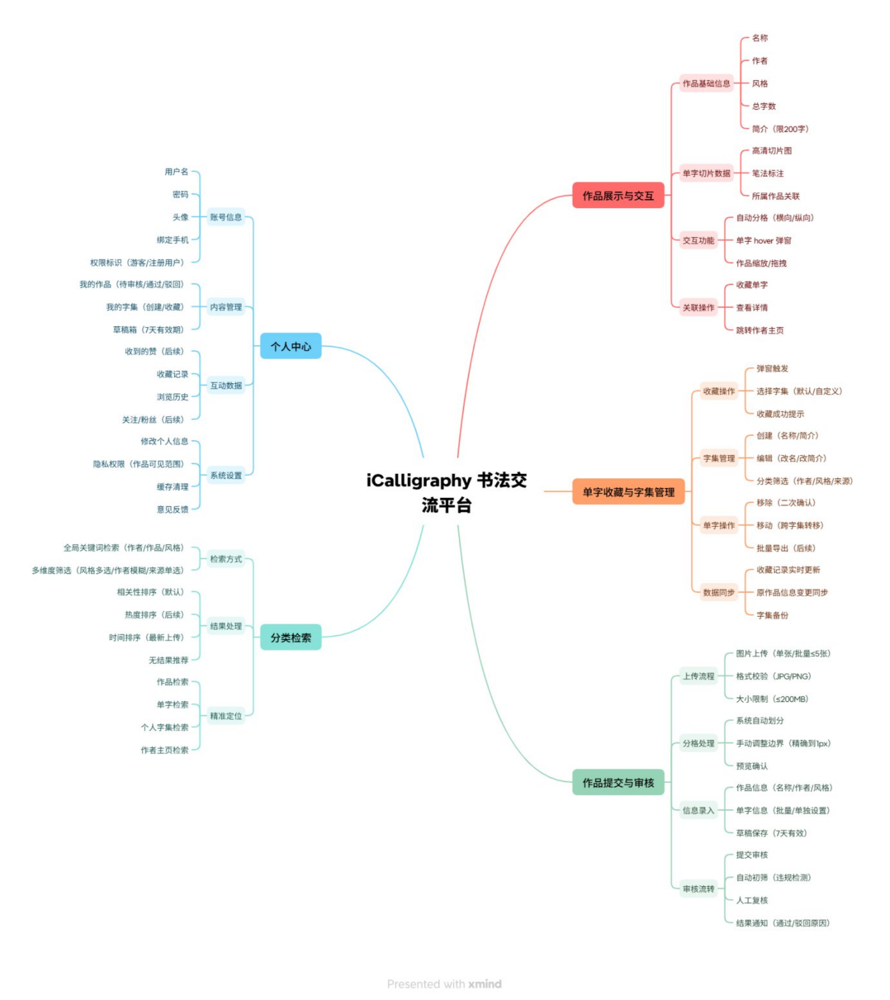
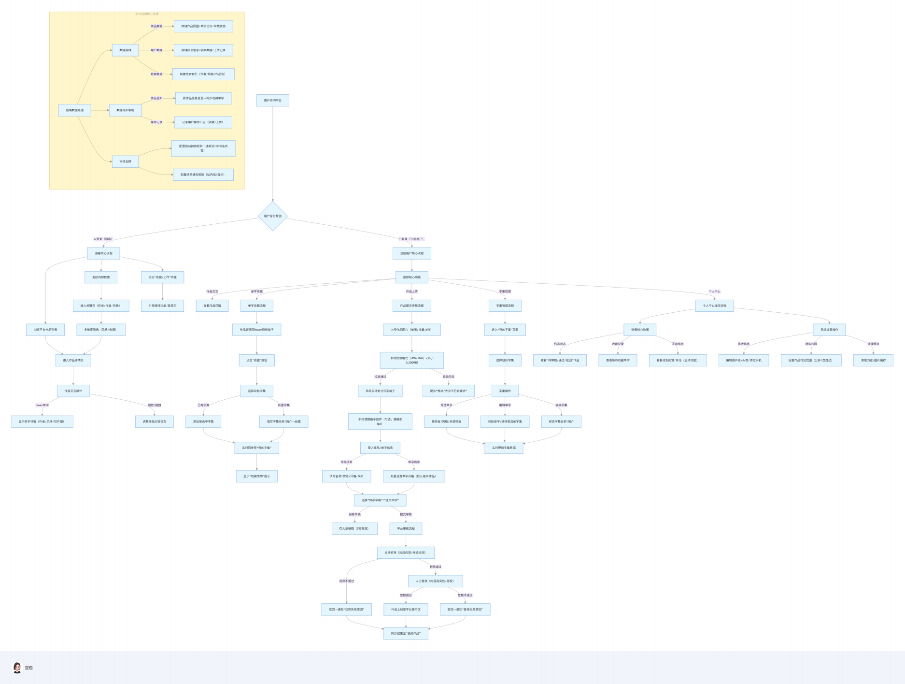

**iCalligraphy 书法交流平台**

产品需求文档

Product Requirement Document

**一、文档说明**

**1.1 文档目的**

明确 iCalligraphy 书法交流平台的产品定位、核心功能、用户流程与落地标准 ，为研发、设计、运营、测试团队提供统一执行依据 ，确保从需求到上线的功能一致性 ，同时支撑后续迭代规划。

**1.2 适用范围**

| 适用角色 | 用途 |
| --- | --- |
| 产品团队 | 功能优先级排序、迭代路线制定 |
| 研发团队 | 数据库设计、接口开发、系统架构搭建 |
| 设计团队 | 界面原型设计、交互逻辑定义、视觉风格统一 |
| 运营团队 | 用户分层运营、 内容审核规则制定、活动策划 |
| 测试团队 | 测试用例设计、功能验证标准确认 |

**1.3 版本信息**

| 版本号 | 修订日期 | 修订人 | 修订说明 |
| --- | --- | --- | --- |
| V1.0 | 2025.11.11 | 杨毅博 | 初始版本 ，基于核心逻辑流程图构建完整文档 |

**二、产品核心信息**

**2.1 产品定位**

面向书法爱好者、学习者及创作者 ，打造 “作品展示 + 单字收藏 + 分类检索 + 创作提交” 的垂直互动平台 ，解决书法学习中 “单字提取难、作品管理散、交流门槛高” 的痛点 ，构建 “浏览 -学习 - 收藏 - 创作 - 分享” 的书法生态闭环。

**2.2 目标用户**

| 用户类型 | 核心需求 | 平台价值 |
| --- | --- | --- |
| 书法学习者 | 收集优质单字临摹、检索目标风格 / 作者作品、参考笔法细节 | 提供单字切片、分类检索、字集管理功能 |
| 书法创作者 | 展示个人作品、沉淀创作成果、获取同行反馈 | 支持作品上传审核、单字信息标注、个人作品集管理 |
| 书法文化爱好者 | 浏览优质书法作品、 了解字体风格与作者背景 | 提供高清作品展示、详细单字信息与作者简介 |

**2.3 核心价值**

• **效率价值** ：单字自动切片 ，无需用户手动裁剪 ；多维度检索 ，10 秒内定位目标内容 ；

• **沉淀价值** ：个人字集分类管理 ，长期积累学习资源 ；创作者作品存档 ，形成个人品牌资产 ；

• **生态价值** ：连接学习者与创作者 ，推动书法文化垂直领域的内容流转与互动交流。

**2.4 产品功能架构图**

**三、核心功能模块详情**

**3.1 作品展示与交互模块**

| 功能点 | 功能描述 | 交互规范 | 数据规则 |
| --- | --- | --- | --- |
| 作品列表展示 | 按 “热门推荐（点赞量）、最新上传（时间）、风格分类” 展示作品缩略图 ，hover 显示作品名称 + 作者 | 列表支持 “ 网格 / 列表” 切换 ，单页展示20 条作品 | 作品缩略图分辨率统一为 300×200px ，无拉伸 |
| 作品自动分格 | 系统按汉字排列方向（横向/ 纵向） 自动分割格子 ，每格对应 1个汉字 ，格子边界为浅灰色（透明度 50%） | 格子大小适配作品尺寸 ，单个格子最小200×200px | 自动分格准确率≥85% ，支持手动调整边界（精确到 1px） |
| 单字hover弹窗 | 鼠标移动至格子时 ，居中显示弹窗 ，包含 “单字高清切片（放大 2倍）、作者、风格、所属作 品、 收藏按钮” | 弹窗显示延迟≤300ms ，鼠标离开后100ms 消失 | 弹窗尺寸固定为 400×300px ，不遮挡当前格子 |
| 作品缩 放 / 拖 拽 | 鼠标滚轮控制缩放（放大上限 ：单字占屏幕 50% ；缩小下限 ：整幅作品完整显示），拖拽可移动超屏作品 | 缩放无卡顿 ，拖拽时作品跟随鼠标实时移动 | 缩放比例范围 ：0.5 倍（缩小）-3 倍（放大） |
| 作品基础信息 | 作品下方显示 “作品名称（加 粗）、作者、风格、总字数、简介（限 200 字）” | 信息区高度≤作品高度的 1/3 ，不遮挡作品主体 | 简介支持换行 ，超出部分显示 “ ...” ，hover 展开 |

**3.2 单字收藏与字集管理模块**

| 功能点 | 功能描述 | 交互规范 | 数据规则 |
| --- | --- | --- | --- |
| 单字收藏触发 | 点击弹窗 “ 收藏” 按钮 ，默认添加至 “我的收藏” 字集 ；支持弹窗选择已有字集或新建字集（填写名称 + 简介） | 收藏成功后显示 Toast提示（“ 已添加至 XX 字集” ，持续 2 秒） | 单个单字可收藏至多个字集 ，收藏记录实时同步 |
| 字集创建 / 编辑 | 新建字集需填写 “名称（必填 ，限 20 字） + 简介（可选 ，限 100 字）” ；支持修改名称、简介及删除字集 | 删除字集需二次确认 （“删除后单字将移除 ，是否确认？”) | 单个用户可创建无限字集 ，字集名称不可重复 |
| 字集分类筛选 | 支持按 “作者（模糊匹配）、风格（下拉 选择 ：楷书 / 行书/ 草书/ 隶书/ 篆 书）、作品来源（系统收录 / 用户上传）”筛选单字 | 筛选条件实时生效 ，结果无匹配时显示 “ 暂无结果 ，推荐热门单字” | 筛选逻辑为 “且” 关系 ，多条件叠加筛选 |
| 单字移除 / 移动 | 字集内单字支持 “移除”（从当前字集删除）或 “移动”（转移至其他字集），操作后显示结果提示 | 移除 / 移动按钮 hover时变色（从默认灰→墨黑） | 移除后单字仅从当前字集删除 ，不影响其他字集 |

**3.3 作品提交与审核模块**

| 功能点 | 功能描述 | 交互规范 | 数据规则 |
| --- | --- | --- | --- |
| 作品图片上传 | 支持单张 / 批量上传（单次最多5 张），格式限 JPG/PNG ，单张大小≤200MB ；上传时显示进度条（百分比） | 非支持格式 / 超大小 ，实时提示 "请上传 JPG/PNG 格式 ，单张≤200MB" | 上传图片分辨率 ≥1000px（长边），保证切片清晰度 |
| 格子手动调整 | 系统自动分格后 ，用户可拖动格子边界调整位置 / 大小 ，支持 "重置为自动分格" 功能 | 调整时显示网格线（红色 ，透明度 80%），调整后点击 "确认分格" 生效 | 手动调整后的数据实时保存 ，刷新页面不丢失 |
| 信息录入 | 作品信息 ：名称（必填）、作者（默认当前用户 ，可修改）、风格（下拉选择）、简介（可选）；单字信息 ：支持批量设置风格（默认继承作品风格） | 信息不全时 ，“提交审核” 按钮置灰并提示 “请完善必填信息” | 作品名称限 50 字 ，简介限500 字 ，单字风格支持批量修改 |
| 草稿保存 / 提交审核 | 支持保存草稿（7 天内有效 ，显示 “草稿” 标识）；提交后进入 “待审核”状态 ，审核结果通过站内信通知 | 草稿列表显示 “最后编辑时间” ，支持 “继续编辑”/“删除草稿” | 草稿自动保存频率 ：每 3分钟 1 次 ，避免数据丢失 |
| 审核流转 | 自动初筛（检测非书法内容 / 违规信息）→人工复核（内容真实性 / 版 权）→结果通知（通过 / 驳回原因） | 审核时效≤24 小时 ，待审核作品显示 “ 审核中” 进度条 | 初筛不通过 ：提示 “ 内容不符合要求（如非书法作 品）” ；复核不通过 ：提示具体原因（如 “作者信息有误”） |

**3.4 分类检索模块**

| 功能点 | 功能描述 | 交互规范 | 数据规则 |
| --- | --- | --- | --- |
| 全局关键词检索 | 顶部检索框输入 "作者 / 作品名称/ 风格" ，实时显示匹配结果（输入延迟 ≤500ms），支持 "作品 / 单字 / 字集"类型切换 | 检索结果按 " 匹配度 （关键词位置）+ 热度 （点赞量）" 排序 ，前 3条高亮显示 | 关键词支持部分匹配（如输入 " 王羲" ，匹配 " 王羲之《兰亭集序》"） |
| 多维度筛选 | 作品列表页侧边栏提供 "风格（多 选）、作者（模糊输入）、作品来源（单选 ：系统 / 用户）" 筛选条件 | 筛选条件可组合 ，选中状态用 "墨黑对勾" 标识 | 筛选结果分页显示 ，每页 20 条 ，支持快速返回顶部 |
| 个人字集检索 | 个人中心内提供字集检索框 ，支持按“字集名称 / 作者 / 风格” 检索个人收藏的单字 | 检索范围仅为当前用户创建的字集 ，不显示其他用户内容 | 检索结果实时更新 ，无匹配时显示 “ 暂无匹配单字” |
| 结果展示切换 | 支持 “列表模式（显示单字 + 基础信 息）”“ 网格模式（仅显示单字切片）” 切换 ，记忆用户上次选择的模式 | 切换按钮位于结果页顶部 ，点击实时切换视图 | 列表模式单页显示 30 个单字 ，网格模式单页 显示 40 个单字 |

**3.5 个人中心模块**

| 功能点 | 功能描述 | 交互规范 | 数据规则 |
| --- | --- | --- | --- |
| 账号信息展示 | 显示头像、用户名、绑定手机、权限标识（普通用户/ 创作者（上传≥10 篇通过作品）） | 头像支持上传 / 裁剪（圆形 ，尺寸 200×200px） | 用户名限 10 字 ，修改后 30天内不可再次修改 |
| 内容管理 | 我的作品 ：按 "待审核 / 通过 / 驳回"分类展示 ；我的字集 ：显示所有创建的字集及单字数量 ；草稿箱 ：显示 7 天内未提交的草稿 | 点击 "我的作品" 可查看审核进度 ，驳回作品支持 "编辑后重新提交" | 待审核作品最多显示 10 条 ，超出分页 ；草稿箱超过7 天自动删除 |
| 互动数据 | 收到的赞（后续功能 ：单字 / 作品被点赞数）、收藏记录（所有收藏的单字列表）、浏览历史（近 30 天浏览的作品） | 互动数据实时更新 ，点击可进入对应详情页 | 浏览历史最多保存 100 条 ，超出自动删除最早记录 |
| 系统设置 | 修改密码、绑定手机、隐私权限（作品可见范围 ：公开 / 仅自己可见）、缓存清理、意见反馈 | 隐私权限修改后实时生 效 ，缓存清理需二次确认 | 缓存清理仅删除本地图片缓存 ，不影响账号数据 |

**四、产品核心逻辑流程**

**4.1 核心逻辑流程图**

**4.2 流程图核心说明**

1\. **角色边界清晰** ：游客仅开放 “浏览 - 检索” 权限 ，注册用户解锁 “ 收藏 - 上传 - 管理” 全功能 ，避免权限混淆 ；

2\. **流程闭环完整** ：关键场景（如作品上传）覆盖 “发起 - 校验 - 操作 - 审核 - 结果同步” 全链路 ，无断点（例 ：审核驳回明确原因 ，支持二次编辑）；

3\. **数据流转同步** ：所有用户操作（收藏 / 编辑 / 上传）均关联 “实时数据同步” ，确保前端展示与后端存储一致 ；

4\. **后端支撑明确** ：单独划分 “后端核心支撑” 模块 ，明确数据存储、 同步、审核规则 ，为研发提供技术落地依据。

**五、用户核心操作流程**

**5.1 游客核心流程（步骤说明）**

1\. 访问平台→浏览作品列表（按热门 / 最新排序）；

2\. 点击作品进入详情页→hover 单字查看信息→缩放 / 拖拽浏览作品 ；

3\. 发起检索 ：输入关键词（如 “ 王羲之”）→筛选 “行书” 风格→查看匹配作品 ；

4\. 点击 “ 收藏 / 上传”→系统引导跳转注册 / 登录页。

**5.2 注册用户 - 单字收藏流程（步骤说明）**

1\. 登录平台→进入作品详情页 ；

2\. hover 目标单字→点击 “ 收藏” 按钮 ；

3\. 选择字集 ：①已有字集（如 “行书单字”）→添加成功 ；②新建字集（填写 “楷书临摹”+ 简介）→创建并添加 ；

4\. 系统显示 “ 收藏成功” 提示→可进入 “我的字集” 查看。

**5.3 注册用户 - 作品上传流程（步骤说明）**

1\. 登录平台→进入 “我的作品”→点击 “ 上传作品” ；

2\. 上传图片 ：选择 1 张书法作品图（JPG 格式 ，100MB）→系统校验通过 ；

3\. 分格处理 ：系统自动划分 n（根据作品字数调整） 个格子→手动调整 多 个格子边界→确认分格 ；

4\. 信息录入 ：填写作品名称 “《兰亭集序》临摹”、作者 “本人”、风格 “行书”→批量设置单字风格为 “行书” ；

5\. 操作选择 ：①点击 “保存草稿”→存入草稿箱 ；②点击 “提交审核”→进入待审核状态 ；

6\. 审核结果 ：24 小时内收到站内信→ ①通过（作品上线）；②驳回（提示 “作者信息需补充”→编辑后重新提交）。

**六、 页面逻辑（暂时未完成项目的实际功能 ，无法展示 ，等项目落实后进行完善修改）**

**七、后续可拓展功能规划**

| 功能模块 | 功能描述 | 优先级 | 依赖基础 |
| --- | --- | --- | --- |
| 社区互动功能 | 作品评论、点赞、分享（至微信 / 微博）；用户可分享字集至平台社区 ，添加临摹心得 | 高 | 作品展示模块、用户数据模块 |
| AI 辅助功能 | AI 自动识别字体风格（准确率 ≥90%）、作者风格分析 ；智能推荐相似单字 / 作品 | 中 | 作品数据积累（需 1000+优质作品）、AI 算法接入 |
| 字形比对工具 | 支持用户上传练习稿 ，与平台单字对比 ，标注笔法差异点（如起笔 / 收笔位置） | 中 | 单字切片数据、图片比对算法 |
| 字集导出功能 | 支持将字集导出为 PDF（含单字 + 信息）/ 图片包 ，用于离线临摹 | 低 | 字集数据模块、文件导出接口 |
| 书法课程联动 | 接入书法教学课程（如楷书入门课），关联课程推荐对应练习单字 | 低 | 外部课程资源合作、用户学习数据积累 |
